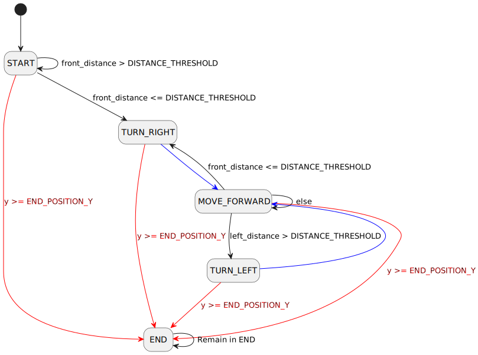

# Resolução do Desafio OxeBots

## Descrição

O robô foi programado com uma máquina de estados finitos para seguir a parede à esquerda até encontrar um obstáculo. Nessa situação, ele decide virar à esquerda ou à direita dependendo se a esquerda está livre. Ao ultrapassar a posição Y = 10, o robô para, indicando que chegou ao final do labirinto. Abaixo, segue o diagrama.

## Estrutura do projeto

O projeto foi desenvolvido puramente em Python na forma de dois pacotes, [desafio_oxebots_erick](./desafio_oxebots_erick) e [`desafio_oxebots_erick_interfaces`](./desafio_oxebots_erick_interfaces). O primeiro contém o código do robô e o segundo contém a definição da interface utilizada para a comunicação entre os nós.

Abaixo um vídeo com a resolução do labirínto:

https://github.com/user-attachments/assets/21cb3346-6552-4d57-b956-3d672a0fa356

## Licença

Este projeto é de código aberto e é livre para que você o modifique ou utilize em suas próprias aplicações. Consulte o arquivo [LICENSE](./LICENSE) para mais detalhes.
